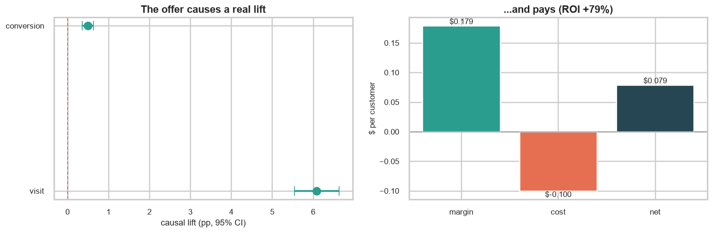
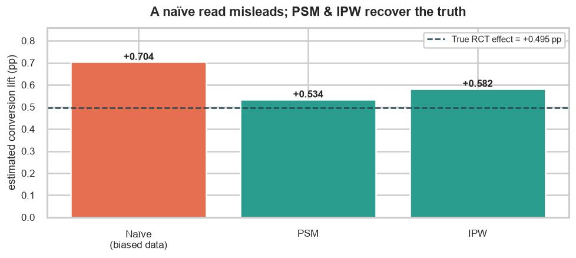
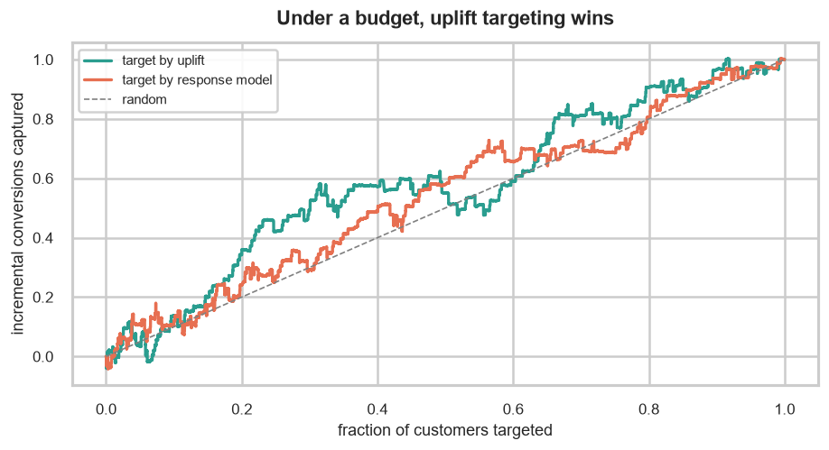

# Causal Impact & Experimentation Engine

Measuring the **true causal effect** of a marketing/retention offer — three ways, increasing in
sophistication: from a clean randomized A/B test, from deliberately messy observational data, and
finally down to *which individual customers* are worth targeting.


> A prediction model answers *"what will happen?"* This project answers the harder question a
> business actually pays for: *"if we send this offer, what happens **because** of it?"*

---

## TL;DR — the result

**Roll out the retention offer.** On a real 64,000-customer randomized experiment it causes a
statistically significant, profitable lift:

- **Conversion +0.50 pp** (0.57% → 1.07%, a **relative +87%** on a rare-event base), 95% CI
  [+0.36, +0.64], *p* ≈ 4×10⁻¹⁰.
- **Spend +$0.60 per customer** → at 30% margin minus the $0.10 send cost, **≈ $0.08 net profit per
  customer (ROI +79%)**, about **$7,900 per 100,000 contacted**.
- On **deliberately biased** observational data a naïve read overstated the effect by **+42%** — but
  **propensity matching and IPW recovered the true number**, so the measurement approach is
  trustworthy even when we can't randomize.
- Under a send budget, **uplift-based targeting** captures **47%** of all incremental conversions in
  the top 30% of customers, versus **32%** for a conventional response model.

## 🚀 Live demo

**[▶ Interactive dashboard](#)** — *deployment link coming soon (Streamlit Community Cloud).*
Plan an experiment's power, watch a naïve estimate drift as bias is dialed up while PSM/IPW hold the
truth, and explore the profit of targeting the top *X%* of customers by predicted uplift. You can also
**score a single hypothetical customer** — enter one profile and get their personal predicted uplift, a
*Target / Don't-target* recommendation, the segment they resemble, and — side by side — what a
conventional response model would have decided for the same person, with a flag when the two disagree.
Run it locally in one line — see [How to run](#how-to-run).

---

## The scenario

I'm a data scientist at a digital bank. The growth team ran a campaign: a segment of customers
received a promotional email ("come back" offer). Leadership doesn't want a model dump — they want a
decision, and it maps onto three questions:

1. **Did the offer work?** The *incremental* effect on activity and spend, over what would have
   happened anyway.
2. **Can we trust observational analysis?** Next time we may not be able to randomize. If we just
   compare who happened to get the offer vs who didn't, do we get the right answer — and if not, how
   do we correct it?
3. **Who should we send it to next time?** The offer costs money. Which customers are *persuadable*
   (worth it), and which are a waste?

## Primary metric & hypotheses

- **Primary outcome:** conversion rate. **Secondary:** spend; **guardrail:** site visits.
- **H₀:** the offer has no effect on conversion. **H₁:** it changes conversion (two-sided).
- **Decision rule:** reject H₀ at α = 0.05; always report the effect size **and** its 95% confidence
  interval; translate the result into projected dollars (30% margin on spend, $0.10 per send).

---

## Results

### Part A — The clean case (A/B test)

The campaign was a genuine randomized experiment (balance verified, no sample-ratio mismatch,
*p* = 0.82), so the treated−control gap **is** the causal effect.

| Metric | Control | Treated | Causal lift (95% CI) | Significance |
|---|---|---|---|---|
| Site visit | 10.6% | 16.7% | **+6.09 pp** [+5.54, +6.63] | *p* ≈ 10⁻⁹³ |
| Conversion *(primary)* | 0.57% | 1.07% | **+0.495 pp** [+0.36, +0.64] | *p* ≈ 4×10⁻¹⁰ |
| Spend | $0.65 | $1.25 | **+$0.597** [+$0.38, +$0.82] | *p* ≈ 10⁻⁷ |



*Rigor:* power/MDE analysis, chi-square SRM check, two-proportion z-test, Welch's t-test for spend,
Cohen's *h*/*d* effect sizes, and multiple-testing correction.

### Part B — The messy case (observational causal inference)

I threw away the randomization, built a **biased** dataset (the offer goes disproportionately to
already-loyal, high-history customers), and compared estimators against the known true effect of
**+0.495 pp**:

| Approach | Estimated conversion lift | Verdict |
|---|---|---|
| **Naïve** (compare who got it) | **+0.704 pp** | ❌ overstates the truth by **+42%** |
| Propensity Score Matching (PSM) | +0.534 pp | ✅ recovers the truth |
| Inverse-Propensity Weighting (IPW) | +0.582 pp | ✅ recovers the truth |



The correction held up under DoWhy's refutation battery (placebo *p* = 0.98, random-common-cause, and
data-subset tests all pass). **Takeaway:** observational read-outs are usable *with* proper causal
adjustment — a raw comparison is not.

### Part C — The money case (uplift modeling)

An uplift model (T-learner and S-learner via scikit-uplift) estimates the offer's effect *per
customer* and ranks them from most to least persuadable.

- **Under a fixed budget, uplift targeting beats a "most-likely-to-convert" model.** In the top 30%
  it captures **47%** of incremental conversions vs **32%** for a response model (Qini AUC 0.043).
- **Segments:** persuadables (target), sure-things (buy anyway), lost-causes (won't buy), and a
  flagged sleeping-dog tail.
- **Per-customer scoring (dashboard):** the same fitted T-learner scores one hypothetical customer on
  demand — enter a profile, get their individual predicted uplift, a *Target / Don't-target* call, and
  the segment they resemble, turning an aggregate policy into a single-record decision tool.
- **Uplift vs. a response model, on one customer.** The scorer shows **two verdicts side by side** for
  that same profile: what the uplift model decides vs. what a conventional *"most-likely-to-convert"*
  response model decides — both read off the *same* fitted model (the response score is just its treated
  arm, P[convert | emailed]) and judged under the *same* send budget, so it's a fair head-to-head. When
  they **disagree** the card flags it and says why: the response model targets anyone likely to buy —
  including *sure-things* who'd buy anyway — while uplift only targets the people the offer actually
  *persuades*. It's the whole thesis of Part C made concrete on a single record.
- **Sleeping dogs — checked, not assumed.** The ~934 flagged candidates showed a held-out
  treated−control gap of **+0.32 pp (*p* = 0.61)** — indistinguishable from zero, so **no
  sleeping-dog segment is claimed**.
- **No fake "optimal reach."** Spend is 99% zeros with a third of revenue from ~0.1% of customers, so the
  profit-vs-reach curve is a noisy difference of subsample means. A **5–95% bootstrap band** (300
  resamples) is ~$3.5k wide, and the apparent peak is only ~3% above full reach — inside the noise. The
  honest read is a **broad plateau**, so I don't claim a precise cutoff.



**Recommendation:** with today's economics the offer is profitable for almost everyone, so target
broadly; when send budget is constrained, prioritize by predicted uplift to maximize incremental
conversions per dollar. Full write-up in [`reports/stakeholder_report.md`](reports/stakeholder_report.md).

---

## Methodological notes

Two deliberate choices, called out because they reflect the honest limits of the data:

1. **Difference-in-Differences is shown on valid panel data, not forced onto Hillstrom.** Hillstrom is
   a single post-treatment snapshot with no pre-period outcome, so a genuine DiD isn't possible on it —
   and DiD isn't the right correction for the cross-sectional selection bias in Part B anyway (that's
   the job of propensity methods). So Part B's headline comparison is **Naïve vs PSM vs IPW vs the true
   RCT effect**, and DiD is demonstrated separately on data that actually has a before/after structure.
2. **The "sleeping dog" segment is validated on a holdout before it's believed.** With conversion at
   ~0.9%, per-customer uplift is noisy, so a raw negative prediction is not proof the offer *hurts*
   anyone. I flag the negative-uplift tail, then check whether the treated-vs-control gap actually
   reproduces on held-out customers, and only claim a real sleeping-dog effect if it survives (it did
   not here — reported honestly).

## Methods & tooling

| Part | Techniques | Key libraries |
|---|---|---|
| A — A/B test | power/MDE, SRM (χ²), two-proportion z-test, Welch's t-test, Cohen's *h*/*d*, Bonferroni/BH | `statsmodels`, `scipy` |
| B — Observational | selection-bias injection, logistic propensity scores, PSM (caliper matching), IPW (Hájek), DoWhy identify→estimate→refute, DiD demo | `scikit-learn`, `dowhy` |
| C — Uplift | T-/S-learners, Qini/AUUC, capture curves, 4-segment split, holdout validation, profit curve | `scikit-uplift`, `lightgbm` |

## Repository layout

```
causal-impact-engine/
├── README.md
├── requirements.txt
├── data/
│   ├── raw/                 # Hillstrom dataset (never edited)
│   └── processed/           # regenerated from raw by src/data_prep.py
├── notebooks/               # 01 EDA · 02 A/B · 03 observational · 04 uplift · 05 synthesis
├── src/                     # reusable modules
│   ├── data_prep.py         # loading, treatment flag, feature encoding, SMD balance
│   ├── ab_test.py           # Part A statistics
│   ├── causal.py            # Part B estimators + DoWhy workflow
│   └── uplift.py            # Part C learners, metrics, segments, targeting
├── app/
│   └── streamlit_app.py     # interactive 3-tab dashboard
├── reports/                 # stakeholder report + exported figures
└── tests/                   # pytest sanity checks for the statistics
```

## How to run

```bash
# 1. Environment (Python 3.12)
python -m venv .venv
# Windows: .venv\Scripts\activate   |   macOS/Linux: source .venv/bin/activate
pip install -r requirements.txt

# 2. Launch the interactive dashboard
streamlit run app/streamlit_app.py

# 3. Reproduce the analysis
jupyter lab            # then run notebooks 01 → 05 in order

# 4. Run the tests
pytest
```

## Data

[Hillstrom "MineThatData" E-Mail Challenge](https://blog.minethatdata.com/2008/03/minethatdata-e-mail-analytics-and-data.html)
— 64,000 customers randomly assigned to a men's email, a women's email, or no email (control). A real
randomized experiment. Treatment is binarized as *any email = 1, no email = 0*.

## Caveats & assumptions

- **Economics are assumptions**, not measured: 30% margin, $0.10/send. All dollar figures scale with them.
- **Rare outcome:** conversion ≈ 0.9%; absolute effects are small (though highly significant), and
  detecting a *smaller* future change would need a much larger sample.
- **Observational validity** rests on unconfoundedness, overlap, and no interference (SUTVA) — which
  held in the Part B test *by construction*; in the wild they must be argued, not assumed.
- **Short window:** a ~2-week measurement may differ from steady state (novelty effects).
